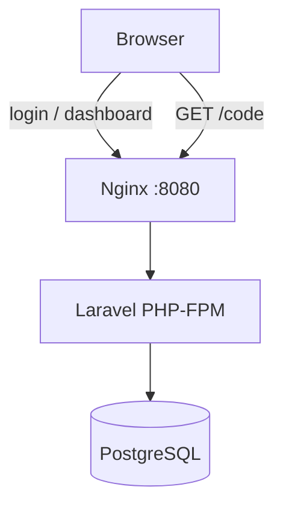

# URL Shortener

Pet-проект: сервис сокращения ссылок на **PHP 8.4**, **Laravel 13**, **PostgreSQL**, **Docker**.

Многопользовательский режим: каждый пользователь видит и управляет только своими ссылками. Есть веб-панель с авторизацией, REST API (сессия), редирект и статистика кликов.

## Статус (roadmap)

| Версия | Статус | Возможности |
|--------|--------|-------------|
| v1.0 | готово | Docker, PostgreSQL, API, редирект, статистика, веб-панель |
| **v2.0** | готово | Авторизация, мультипользовательский режим |
| v2.1 | план | Кеш при редиректе |
| v2.2 | план | QR-коды, кастомные алиасы |
| v2.3 | план | Очереди для кликов |
| v2.4 | план | OpenAPI, GitHub Actions |

## Архитектура



### Слои приложения (облегчённый DDD)

```text
app/
├── Domain/ShortUrl/       # сущности, value objects, репозиторий
├── Application/ShortUrl/  # commands, queries, DTO
├── Infrastructure/        # Eloquent, persistence
├── Http/                  # контроллеры, requests
└── Models/User.php        # авторизация
```

## Быстрый старт

Требования: **Docker** и **Docker Compose**.

```bash
make setup
```

Приложение: [http://localhost:8080](http://localhost:8080)

### Тестовые пользователи

После `make setup` в БД создаются два пользователя:

| Email | Пароль |
|-------|--------|
| `alice@example.com` | `password` |
| `bob@example.com` | `password` |

Войдите на `/login` — у каждого пользователя свои ссылки и статистика.

### Полезные команды

```bash
make up          # запустить контейнеры
make down        # остановить
make migrate     # миграции
make seed        # тестовые пользователи
make test        # тесты
make shell       # shell в контейнере app
```

Локально без Docker (PHP 8.4+, Composer, SQLite для тестов):

```bash
composer install
cp .env.example .env
php artisan key:generate
php artisan migrate
php artisan db:seed
php artisan test
```

## Авторизация и мультипользовательский режим

- **Вход** — `/login`, сессионная авторизация Laravel (`web` guard).
- **Выход** — кнопка «Выйти» на панели.
- **Защита** — панель (`/`) и API (`/api/v1/*`) доступны только авторизованным.
- **Изоляция** — у каждой записи `short_urls` есть `user_id`; статистика и создание привязаны к текущему пользователю.
- **Редирект** — `GET /{shortCode}` остаётся публичным (без входа).

## API (требуется авторизация)

Сессионные cookie после входа через браузер. Для `POST` нужен заголовок `X-CSRF-TOKEN`.

### Создать короткую ссылку

```http
POST /api/v1/short-urls
Content-Type: application/json

{
  "url": "https://example.com/article"
}
```

Ответ `201`:

```json
{
  "id": "550e8400-e29b-41d4-a716-446655440000",
  "short_url": "http://localhost:8080/Ax7B2k1",
  "original_url": "https://example.com/article"
}
```

### Статистика (только свои ссылки)

```http
GET /api/v1/short-urls/{id}/stats
```

Ответ `200`:

```json
{
  "clicks": 125,
  "unique_visitors": 82,
  "last_click_at": "03.06.2026 14:30:00"
}
```

Чужая ссылка → `404`.

### Редирект (публичный)

```http
GET /{shortCode}
```

Ответ `302` → оригинальный URL. Каждый переход пишется в `clicks`.

## Схема БД

**users** — `id`, `name`, `email`, `password`, `remember_token`, timestamps

**short_urls** — `id` (UUID), `user_id`, `original_url`, `short_code`, `created_at`

**clicks** — `id`, `short_url_id`, `ip`, `user_agent`, `referer`, `created_at`

## Переменные окружения

| Переменная | Описание |
|------------|----------|
| `APP_URL` | Базовый URL приложения |
| `SHORT_URL_BASE` | База для коротких ссылок |
| `DB_*` | PostgreSQL |

## Структура репозитория

```text
app/Domain|Application|Infrastructure|Http/
database/migrations/ + seeders/
resources/views/login.blade.php, dashboard.blade.php
docker/ + docker-compose.yml + Makefile
routes/web.php
tests/Feature/
```

## Стек

- PHP 8.4 (FPM), Laravel 13
- PostgreSQL 17
- Docker Compose, Makefile
- PHPUnit, Laravel Pint

## Лицензия

MIT
