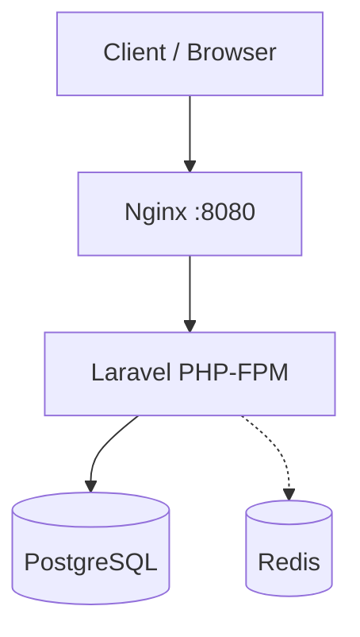

# URL Shortener

Pet-проект: сервис сокращения ссылок на **PHP 8.4**, **Laravel 13**, **PostgreSQL**, **Redis**, **Docker**.

Показывает базовую backend-архитектуру: REST API, редирект, учёт кликов, слои DDD, тесты и контейнеризация.

## Статус (roadmap)


| Версия   | Статус | Возможности                                                 |
| -------- | ------ | ----------------------------------------------------------- |
| **v1.0** | готово | Docker, PostgreSQL, миграции, API, редирект 302, статистика |
| v1.1     | план   | Redis-кеш при редиректе                                     |
| v1.2     | план   | QR-коды, кастомные алиасы                                   |
| v1.3     | план   | Очереди для кликов                                          |
| v1.4     | план   | OpenAPI                                                     |
| v1.5     | план   | GitHub Actions                                              |
| v2.0     | план   | Авторизация, мультипользовательский режим                   |


## Архитектура




Redis подключён в Docker — активное использование при редиректе запланировано в v1.1. Очереди и авторизация в v1.0 не используются.

### Слои приложения (облегчённый DDD)

```text
app/
├── Domain/ShortUrl/
│   ├── Entities/          # ShortUrl, Click
│   ├── ValueObjects/      # OriginalUrl, ShortCode
│   ├── Services/          # ShortCodeGenerator (Base62)
│   └── Contracts/         # ShortUrlRepository
├── Application/ShortUrl/
│   ├── DTO/
│   ├── Commands/          # CreateShortUrl, RecordClick
│   └── Queries/           # GetShortUrlStats
├── Infrastructure/
│   └── Persistence/       # Eloquent models + repository
└── Http/
    ├── Controllers/
    └── Requests/
```

## Быстрый старт

Требования: **Docker** и **Docker Compose**.

```bash
make setup
```

Приложение: [http://localhost:8080](http://localhost:8080) — веб-панель для создания ссылок и просмотра статистики.

### Полезные команды

```bash
make up          # запустить контейнеры
make down        # остановить
make migrate     # применить миграции
make test        # тесты (в контейнере)
make shell       # shell в контейнере app
make pint        # форматирование кода
```

Локально без Docker (нужны PHP 8.4+, Composer, SQLite для тестов):

```bash
composer install
cp .env.example .env
php artisan key:generate
php artisan test
```

## API

### Создать короткую ссылку

```http
POST /api/v1/short-urls
Content-Type: application/json

{
  "url": "https://example.com/article"
}
```

Ответ `201`:

```json
{
  "id": "550e8400-e29b-41d4-a716-446655440000",
  "short_url": "http://localhost:8080/Ax7B2k1",
  "original_url": "https://example.com/article"
}
```

### Статистика переходов

```http
GET /api/v1/short-urls/{id}/stats
```

Ответ `200`:

```json
{
  "clicks": 125,
  "unique_visitors": 82,
  "last_click_at": "03.06.2026 14:30:00"
}
```

### Редирект

```http
GET /{shortCode}
```

Ответ `302` → оригинальный URL. Каждый переход сохраняется в таблицу `clicks`.

## Схема БД

**short_urls** — `id` (UUID), `original_url`, `short_code`, `created_at`

**clicks** — `id`, `short_url_id`, `ip`, `user_agent`, `referer`, `created_at`

Короткий код: случайная строка Base62, длина 7 символов (настраивается через `SHORT_CODE_LENGTH`).

## Переменные окружения


| Переменная       | Описание                                            |
| ---------------- | --------------------------------------------------- |
| `APP_URL`        | Базовый URL приложения                              |
| `SHORT_URL_BASE` | База для коротких ссылок (по умолчанию = `APP_URL`) |
| `DB_`*           | PostgreSQL                                          |
| `REDIS_*`        | Redis                                               |


## Структура репозитория (v1.0)

```text
app/Domain|Application|Infrastructure|Http/   # бизнес-логика
database/migrations/                           # short_urls, clicks
docker/ + docker-compose.yml + Makefile
routes/api.php, routes/web.php
tests/Feature/ShortUrl/, tests/Unit/
```

Простой фронтенд: `resources/views/dashboard.blade.php` (Blade + vanilla JS, без сборки). Без users/jobs/cache-миграций.

## Стек

- PHP 8.4 (FPM), Laravel 13
- PostgreSQL 17, Redis 7 (инфраструктура Docker)
- Docker Compose, Makefile
- PHPUnit, Laravel Pint

